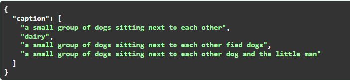
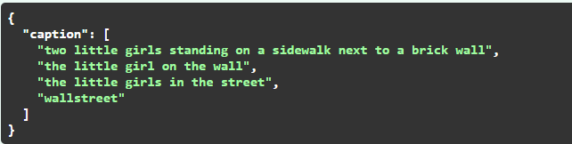
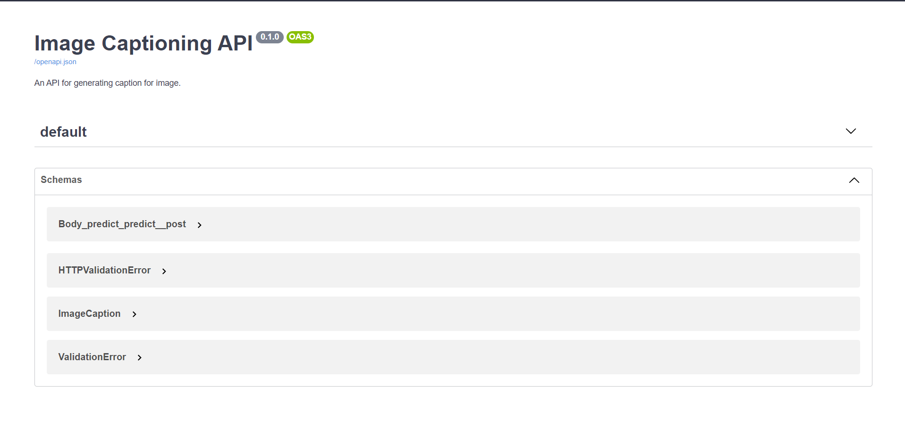

### [Language-model-that-can-create-creative-captions]
# CreativeCaptions.ai
Language Model that creates catchy, exciting, innovative, captivating, creative and engaging captions instead of just a description of the picture.

## Samples
### 1.
<p>
    
</p>

> Output 
<p>
    
</p>

### 2.
<p>
    
</p>

> Output 
<p>
    
</p>

# How to use it

## Environment setup
### Folder Structure
Download the repository and make sure we have below file structure.
```
CreativeCaptions.ai-Language-model-that-can-create-creative-captions/
|
├── images/
|     |__ Images5.png
|     |__ Images6.png
|
├── models_folder/
|     |__ gpt2_medium_joke_insta.pt
|     |__ ..
|
├── main.py
|
├── main2.py
|
├── modules.py
|
└── requirements.txt
```
Change your working directory to `CreativeCaptions.ai-Language-model-that-can-create-creative-captions`. 
Download the model `gpt2_medium_joke_insta.pt` from https://www.kaggle.com/code/raj401/inference-mnist and store it in `models_folder`

### Dependencies
Install below libraries.<br>
```
pip install sentencepiece
pip install transformers
pip install torch
pip install fastapi
pip install starlette
pip install aiofiles
pip install python-multipart
pip install Pillow
pip install uvicorn
```

### Inference
Everything is set up now. 
We can now run `python main2.py images/Image6.png` from `terminal` to see the output for `Image6`.

Next we wrap this codebase inside `FastAPI` kind of microservice. And we can use this as an `API`.<br>
To launch it on localhost `http://127.0.0.1:8000`, we run below cmd from the terminal.<br>
`uvicorn main:app --reload`  
> Below is a demo of how our page looks. 
<p>
    
</p>


# How it works: 
It addresses the problem in two steps: 
1. It converts an image into simple caption 
2. It converts simple captions into something more interesting/creative text. 

For the 1st step, I am using Encoder-Decoder type model(pretrained model from hugging face). 

For the 2nd step, I have used fine-tuned GPT-2 Model from Hugging face. 
In this step our model tries to change a sentence in a humorous/creative text given any input word or words it has never seen before.
For this task , I took two datasets (short jokes from reddit + movie title puns). For the Jokes in our dataset we took only those which were question,answer types and started with Why,When,How,etc. Then processed all the data in this format
<|soq|> question <|sep|> answer <|endoftext|>

It looks like an input to Question answering system , only the whole string is treated as one string , instead of getting different token_type_ids for Questions and Asnwers<br>

## References/Datasources
short jokes from reddit: https://www.kaggle.com/datasets/abhinavmoudgil95/short-jokes <br>
movie title puns: https://www.kaggle.com/datasets/mikahama/movie-title-puns?select=humor_titles.csv
