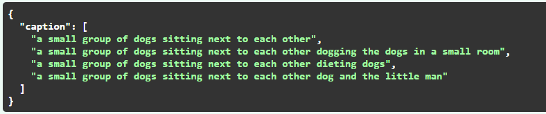

### [Language-model-that-can-create-creative-captions]
# CreativeCaptions.ai
Language Model that creates catchy, exciting, innovative, captivating, creative and engaging captions instead of just a description of the picture.

## Samples
### 1.
<p>
    
</p>

> Output 
<p>
    
</p>

### 2.
<p>
    
</p>

> Output 
<p>
    
</p>
# How to use it

## Environment setup
### Folder Structure
Download the repository and make sure we have below file structure.
```
CreativeCaptions.ai-Language-model-that-can-create-creative-captions/
|
├── images/
|     |__ Images5.png
|     |__ Images6.png
|
├── models_folder/
|     |__ gpt2_medium_joke_insta.pt
|     |__ ..
|
├── main.py
|
├── modules.py
|
└── requirements.txt
```
Change your working directory to `CreativeCaptions.ai-Language-model-that-can-create-creative-captions`. 
Download the model `gpt2_medium_joke_insta.pt` from https://www.kaggle.com/code/raj401/inference-mnist and store it in `models_folder`

### Dependencies
Install below libraries.<br>
```
pip install sentencepiece
pip install transformers
pip install torch
pip install fastapi
pip install starlette
pip install aiofiles
pip install python-multipart
pip install Pillow
pip install uvicorn
```

### Inference
Everything is set up now. 
We can now run `python main2.py images/Image6.png` from `terminal` to see the output for `Image6`.

Next we wrap this codebase inside `fastapi` kind of microservice. And we can use this as an `API`. 
To launch it on localhost `http://127.0.0.1:8000`, we run below cmd from the terminal. 
`uvicorn main:app --reload`  
> Below is the demo of how our page looks. 
<p>
    
</p>
